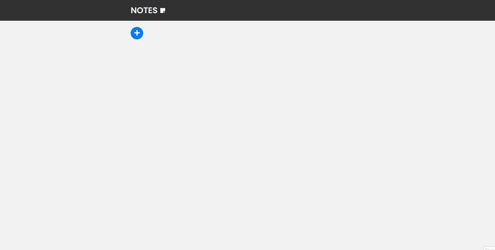

Notes App Front

## Sumário
- **[Sobre](#sobre)**
- **[Pré-requisitos](#pré-requisitos)**
- **[Instalação](#instalação)**
- **[Tecnologias](#tecnologias)**

## GIF do Notes

## Sobre
Projeto feito com ReactJS. Um app de notas, onde o usuário pode adicionar, visualizar, atualizar ou remover notas adesivas. Faz o uso de uma API externa para consultar os dados, que são: título da nota, conteúdo da nota, e data de criação/atualização da nota.  
**OBS: Para testar o projeto completo, recomendo fazer o clone e rodar o servidor deste respositório: https://github.com/guigovaski/node-notes-back.git**

## Pré-requisitos
Antes de começar, você precisa ter instalado em sua máquina as seguintes ferramentas: [Git](https://git-scm.com). Além disso, é interessante que tenha instalado um editor de código como o [VSCode](htts://code.visualstudio.com/).  

## Instalação

### Clone este repositório
`$ git clone https://github.com/guigovaski/react-notes-front.git`

### Instala as dependências
`$ npm install`

### Execute o servidor
`$ npm run start`

## Tecnologias
As seguintes tecnologias foram utilizadas para desenvolver este projeto:
- [React](https://pt-br.reactjs.org/)
    - [React-router-dom](https://v5.reactrouter.com/)
- [Typescript](https://www.typescriptlang.org/)
